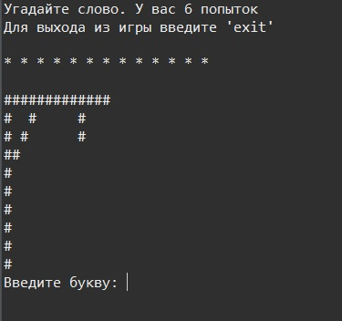
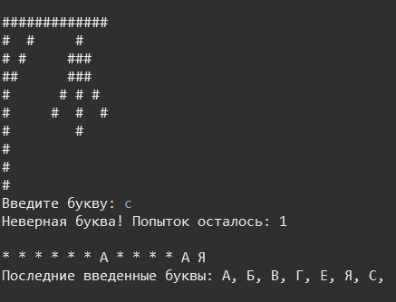
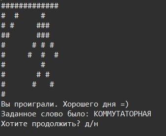

# Игра "Виселица"

## Автор: Viktor

### Правила игры

Игра консольного типа. Игрок угадывает слово по буквам, которое рандомно предлагает игра. Всего 6 попыток. Для выхода досрочно из игры ввести "exit". Каждая неверная буква означает появление одной части тела повешенного. Если игрок потратил все свои попытки и не угадал слово, появляется вся фигура и выбор между тем, чтобы закончить игру или начать заново. При выйгрыше такой выбор тоже присутствует.
#### Пример

 

#### Примечания:
- Игра на русском языке (все заданные слова только на русском)
- Вводимые символы русские иначе ввод будет восприниматься ошибкой, кроме случая когда нужно выйти из игры досрочно.
- Если случайно в строке введется больше одного символа, программа засчитает только первый символ
- Можно вводить буквы как в верхнем так и в нижнем регистре, ошибкой это не будет

